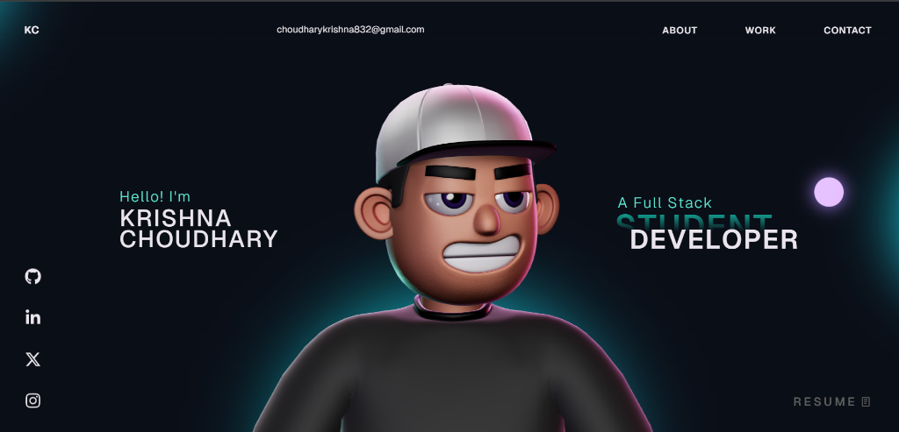

# Krishna - Portfolio 🚀

I am a Computer Science Engineer (Chandigarh University) specializing in Full-Stack Development and AI Automation. I love building high-performance web apps with interactive 3D visuals and integrating smart Computer Vision solutions like YOLOv8.

My focus is on writing clean, scalable code and creating seamless user experiences that bridge the gap between complex logic and creative design.
## Preview

