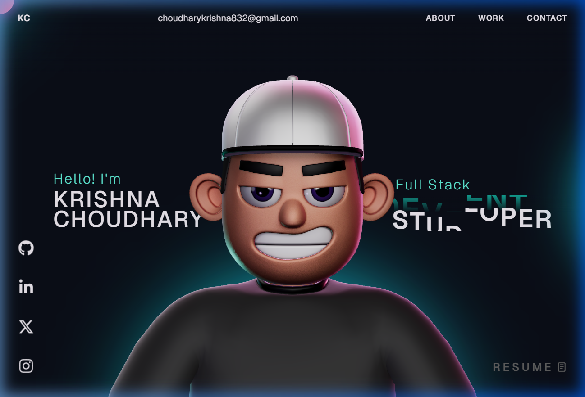

# Krishna Choudhary - Portfolio Portfolio 🚀

Welcome to my portfolio website! Built with React and Three.js, this site showcases my work as a Full Stack Student Developer.

## Preview

## Tech Stack

- **Frontend**: React, Three.js, GSAP
- **Backend/Data**: Node.js, JSON
- **Styling**: Vanilla CSS, Modern animations

## Project Structure

This project has been converted from TypeScript to JavaScript for easier maintenance while keeping all interactive components and 3D features intact.

- `My-Krishna/src/components`: Core UI components
- `My-Krishna/src/components/Character`: 3D Avatar and animations
- `My-Krishna/public/resume.pdf`: Professional Resume
